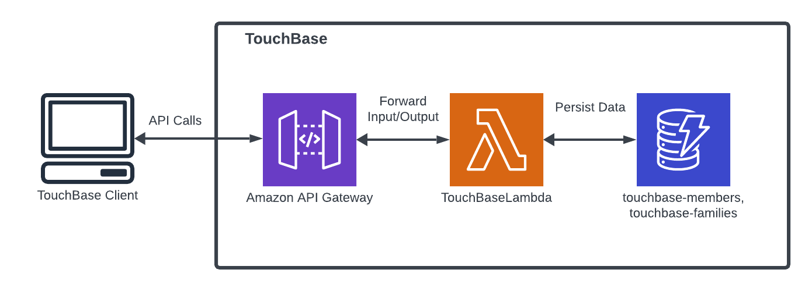
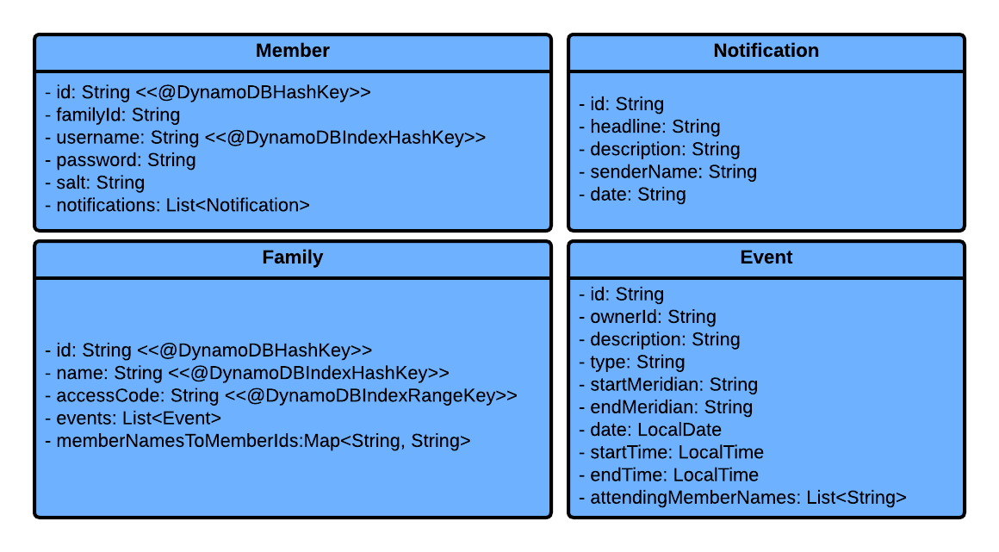

# TouchBase Design Document

## Background

This design document describes the API for Touchbase, a family event management application.

## Architecture



## TouchBase Implementation Notes

### CreateMember Endpoint
* Accepts `POST` requests to `/member`
* Accepts a name and password to create a new Member
    * If the username is associated with an existing Member, will throw `UsernameTakenException`
    * If the request does not contain a name, will throw an `InvalidInputException`
    * If the request does not contain a valid password, will throw an `InvalidPasswordException`
* Creates a List of notifications containing a welcome message from touchbase
* Uses the TouchBaseIdGenerator utility class to generate a unique Id for the Member
* Uses TouchBasePasswordAuthentication utility class to encrypt the given password before being stored in the database
* Returns the newly created Member

### MemberLogin Endpoint
* Accepts `GET` requests to `/member`
* Accepts a name and password to return an existing Member with the associated Login credentials
* Queries DynamoDB for a Member with the given username
    * If no username matches the given username, will throw a `MemberNotFoundException`
* Uses TouchBasePasswordAuthentication utility class to check if the given password matches the password stored in the
  database
    * If the password does not match, will throw an `InvalidInputException`
* Returns Member's Member Id and Family Id

### GetMember Endpoint
* Accepts `GET` requests to `/member/{id}`
* Accepts a Member Id to return the corresponding Member's details
    * If there is no member associated with given the Id, will throw a `MemberNotFoundException`
* Returns the Member's details

### DeleteMember Endpoint

### GetMemberNotifications Endpoint
* Accepts `GET` requests to `/member/{id}/notifications`
* Accepts a Member Id to return the corresponding Member's notifications
    * If there is no member associated with given the Id, will throw a `MemberNotFoundException`
* Returns a List of the Member's Notifications

### DeleteMemberNotification Endpoint
* Accepts `DELETE` requests to `/member/{id}/notifications/`
* Accepts a Member Id and Notification Id to delete the corresponding Member's Notifications
    * If there is no Member associated with given the Id, will throw a `MemberNotFoundException`
    * If there is no Notification associated with given the Id, will throw a `NotificationNotFoundException`
* Returns the updated List of Notifications

### CreateFamily Endpoint
* Accepts `POST` requests to `/family`
* Accepts a name for the family and Id of the member who is creating the Family.
    * If there is no Member associated with given the Id, will throw a `MemberNotFoundException`
    * If the member is already a member of another family, will throw `MemberHasFamilyException`
    * If there is no name for the family, will throw `InvalidInputException`
* Uses a AccessCodeGenerator utility class to generate an access code for the Family, uses TouchBaseIdGenerator utility
  class to generate a unique Id for the Family, and creates an empty Event list for future events to be stored in
* Sets the Member's Family Id to the generated Id
* Returns the newly created family

### GetFamily Endpoint
* Accepts `GET` requests to `/family/{id}`
* Accepts a Family Id to return the corresponding Family's details
    * If there is no Family associated with given the Id, will throw a `FamilyNotFoundException`
* Returns the Family's details

### JoinFamily Endpoint
* Accepts a `PUT` request to `/family`
* Accepts a Family's name, access code, and Member Id of the Member that wants to join the Family
    * If there is no access code or family name, will throw `InvalidInputException`
    * If there is no member associated with the given Id, will throw `MemberNotFoundException`
    * If the member already has a family, will throw `MemberHasFamilyException`
    * If there is no Family associated with the name and access code, will throw `FamilyNotFoundException`
* Updates the Member's Family Id with the Id that corresponds to the given name and access code
* Notifies all Members in the Family that there is a new Member
* Adds the Member to Family
* Returns the updated Family

### CreateEvent Endpoint
* Accepts `POST` requests to `/family/{id}/events`
* Accepts a Family Id and data to create an Event see requests
    * If the end time is before the start time of the event, will throw ``
    * If the date is before the current data, will throw ``
    * If there is no Family associated with the name and access code, will throw `FamilyNotFoundException`
* Converts the input time and date Strings into LocalTime and LocalDate objects for easier comparisons
* Creates a new Event with a generated Id unique to that Event
* Uses  utility class to insert the Event in its proper chronological order
* Returns the Family's list of Events including the newly created Event

### JoinEvent Endpoint
* Accepts `PUT` requests to `/family/{id}/events`
* Accepts a Family Id, Member Id, and Event Id of the event the Member wants to join
    * If there is no member associated with the given Member Id, will throw `MemberNotFoundException`
    * If there is no Family associated with the given Family Id, will throw a `FamilyNotFoundException`
    * If there is no Event associated with the given Event Id, will throw a `EventNotFoundException`
* Notifies all members in that event that a new Member has joined
* Adds the Member to the Event
* Returns the Family's list of events with the updated event

### GetEvents Endpoint
* Accepts `GET` requests to `/family/{id}/events`
* Accepts a Family Id
    * If there is no Family associated with the given Family Id, will throw a `FamilyNotFoundException`
* Returns the Family's list of Events


## Data Models



### CreateMember:
#### Request
```json
{
  "name": "JohnDoeUsername",
  "password": "Password1"
}
```
#### Result
```json
{
  "member": {
    "id": "ec1046f9-33c8-47c3-b8a6-b61d680b2ac0",
    "name": "JohnDoeUsername",
    "notifications": [
      {
        "id": "eee55efb-d66a-4aac-8b0d-ac00cdbb9eb6",
        "headline": "WELCOME!",
        "description": "Welcome to TouchBase! No matter how far from home, you'll always be able to touchbase!",
        "senderName": "TouchBase",
        "date": "2023-10-03"
      }
    ]
  }
}
```

### MemberLogin:
#### Request
```json
{
  "name": "JohnDoeUsername",
  "password": "Password1" 
}
```
#### Result
```json
{
  "id": "ec1046f9-33c8-47c3-b8a6-b61d680b2ac0",
  "familyId": "d5cb8cbb-52a6-46fa-9e5f-fac155feb81b"
}
```

### GetMember:
#### Request
```json
{
  "id": "ec1046f9-33c8-47c3-b8a6-b61d680b2ac0"
}
```
#### Result
```json
{
  "member": {
    "id": "ec1046f9-33c8-47c3-b8a6-b61d680b2ac0",
    "name": "JohnDoeUsername",
    "notifications": [
      {
        "id": "eee55efb-d66a-4aac-8b0d-ac00cdbb9eb6",
        "headline": "WELCOME!",
        "description": "Welcome to TouchBase! No matter how far from home, you'll always be able to touchbase!",
        "senderName": "TouchBase",
        "date": "2023-10-03"
      }
    ]
  }
}
```
### GetMemberNotifications:
#### Request
```json
{
  "id": "ec1046f9-33c8-47c3-b8a6-b61d680b2ac0"
}
```
#### Result
```json
{
  "notifications": [
    {
      "id": "eee55efb-d66a-4aac-8b0d-ac00cdbb9eb6",
      "headline": "WELCOME!",
      "description": "Welcome to TouchBase! No matter how far from home, you'll always be able to touchbase!",
      "senderName": "TouchBase",
      "date": "2023-10-03"
    }
  ]
}
```

### DeleteMemberNotification:
#### Request
```json
{
  "id": "ec1046f9-33c8-47c3-b8a6-b61d680b2ac0",
  "notificationId": "eee55efb-d66a-4aac-8b0d-ac00cdbb9eb6"
}
```
#### Result
```json
{
  "notifications": []
}
```

### CreateFamily:
#### Request
```json
{
  "creatorId": "ec1046f9-33c8-47c3-b8a6-b61d680b2ac0",
  "name": "The Doe Family"
}
```
#### Result
```json
{
  "family": {
    "id": "d5cb8cbb-52a6-46fa-9e5f-fac155feb81b",
    "name": "The Doe Family",
    "accessCode": "36950816",
    "memberNames": [
      "JohnDoeUsername"
    ]
  }
}
```
### GetFamily:
#### Request
```json
{
  "id": "d5cb8cbb-52a6-46fa-9e5f-fac155feb81b"
}
```
#### Result
```json
{
  "family": {
    "id": "d5cb8cbb-52a6-46fa-9e5f-fac155feb81b",
    "name": "The Doe Family",
    "accessCode": "36950816",
    "memberNames": [
      "JohnDoeUsername"
    ]
  }
}
```
### JoinFamily:
#### Request
```json
{
  "familyName": "The Doe Family",
  "accessCode": "36950816",
  "memberId": "om12e613-b93c-470b-8d7e-1b7924b4aaf1"
}
```
#### Result
```json
{
  "family": {
    "id": "d5cb8cbb-52a6-46fa-9e5f-fac155feb81b",
    "name": "The Doe Family",
    "accessCode": "36950816",
    "memberNames": [
      "JohnDoeUsername",
      "JaneDoeUsername"
    ]
  }
}
```
### CreateEvent:
#### Request
```json
{
  "familyId": "d5cb8cbb-52a6-46fa-9e5f-fac155feb81b",
  "ownerName": "JohnDoeUsername",
  "type": "Dinner",
  "date": "2023-12-01",
  "startMeridian": "PM",
  "endMeridian": "PM",
  "startTime": "9:00",
  "endTime": "11:00",
  "description": "This is the description for dinner",
  "attendingMemberNames": [
    "JohnDoeUsername"
  ]
}
```
#### Result
```json
{
  "familyEvents": [
    {
      "id": "9a6e6f27-723b-4c03-92c3-bfa133ad45dc",
      "ownerId": "Test",
      "description": "This is the description for dinner",
      "type": "Dinner",
      "date": "12/1/2023",
      "startTime": "9:00 PM",
      "endTime": "11:00 PM",
      "attendingMemberNames": [
        "JohnDoeUsername"
      ]
    }
  ]
}
```

### JoinEvent:
#### Request
```json
{
  "memberId": "om12e613-b93c-470b-8d7e-1b7924b4aaf1",
  "familyId": "d5cb8cbb-52a6-46fa-9e5f-fac155feb81b",
  "eventId": "9a6e6f27-723b-4c03-92c3-bfa133ad45dc"
}
```
#### Result
```json
{
  "familyEvents": [
    {
      "id": "9a6e6f27-723b-4c03-92c3-bfa133ad45dc",
      "ownerId": "Test",
      "description": "This is the description for dinner",
      "type": "Dinner",
      "date": "12/1/2023",
      "startTime": "9:00 PM",
      "endTime": "11:00 PM",
      "attendingMemberNames": [
        "JohnDoeUsername",
        "JaneDoeUsername"
      ]
    }
  ]
}
```
### GetEvents:
#### Request
```json
{
  "familyId": "d5cb8cbb-52a6-46fa-9e5f-fac155feb81b",
  "memberId": "ec1046f9-33c8-47c3-b8a6-b61d680b2ac0"
}
```
#### Result
```json
{
  "familyEvents": [
    {
      "id": "9a6e6f27-723b-4c03-92c3-bfa133ad45dc",
      "ownerId": "Test",
      "description": "This is the description for dinner",
      "type": "Dinner",
      "date": "12/1/2023",
      "startTime": "9:00 PM",
      "endTime": "11:00 PM",
      "attendingMemberNames": [
        "JohnDoeUsername",
        "JaneDoeUsername"
      ]
    }
  ]
}
```
